# Stages 1–6(a) gallery

Run `bun run gallery` from the project root to regenerate the files in `rendered/`.
SVG and PNG are generated from the same immutable fragment. The PNG conversion
uses `rsvg-convert`; no browser or old layout engine is involved.

Stage 6(a) adds positioned Group canvases, using ordinary elements as children:

| Example | What to inspect |
|---|---|
| [group.jsx](./group.jsx) | Fractional positions, fixed-pixel nodes and strokes, and a text region that reflows at two canvas widths. |
| [group_anchors.jsx](./group_anchors.jsx) | Nested local canvases; top-left, center, and bottom-right anchors at the same fractional position. |
| [group_clip.jsx](./group_clip.jsx) | The same artwork with and without clipping; shared child fragments and retained overflow. |

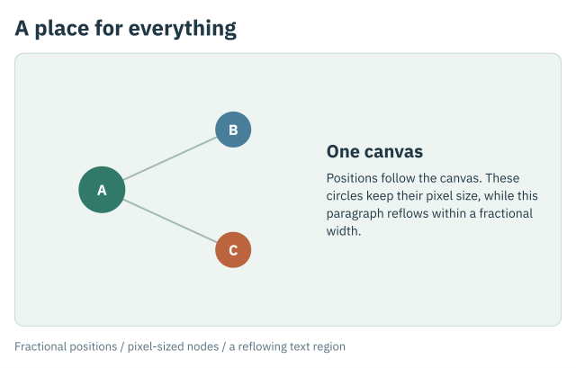
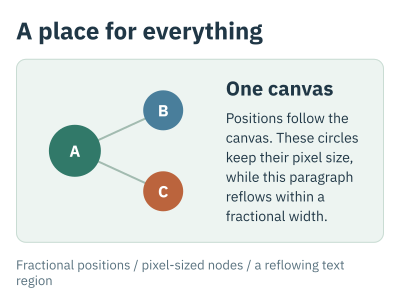

Group's 2:1 canvas changes from 608×304 to 368×184. The nodes keep their 52px
and 40px diameters, while the paragraph's width changes from 237.12px to 143.52px
and its line count from four to six. Each rendering uses 18 queries. Compare the
[wide tree](./rendered/group.tree) and [narrow tree](./rendered/group_narrow.tree).
The canvas height comes from its aspect; the surrounding column and Box add their
natural text heights, gaps, and padding afterward.

```sh
bun scripts/gum.ts examples/group.jsx --width 480 -o /tmp/group.png
```

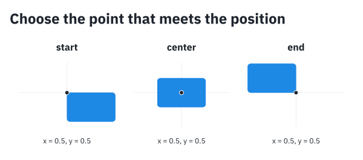

Each nested Group has its own reference rectangle. The dark dot marks `(0.5,0.5)`;
the same 80×48 Box places a different point at that position. Its allocated box,
including its inside border, determines the anchor. See the
[anchor tree](./rendered/group_anchors.tree).

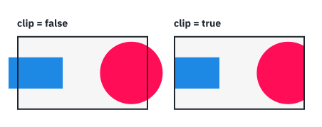

Both canvases remain 180×100. The clipped version has the same 14px left and
22.4px right overflow, while only paint inside its rectangle is visible. The
[clipping tree](./rendered/group_clip.tree) records both results. Three cache hits
reuse the background, rectangle, and circle fragments between canvases.

The stage 5 sources use ordinary stacks and Boxes throughout:

| Example | What to inspect |
|---|---|
| [stack.jsx](./stack.jsx) | Fixed-width labels, growing paragraphs, and fixed-size Squares in rows nested inside columns. The same source renders at 620px and 360px. |
| [stack_hugging.jsx](./stack_hugging.jsx) | A natural row inside a natural column; the Box and Svg hug the whole result. |
| [stack_flex.jsx](./stack_flex.jsx) | Weighted growth, redistribution after a maximum, explicit shrinkage, and Spacer. |
| [stack_alignment.jsx](./stack_alignment.jsx) | Mixed-font baselines, space-between packing, and a bar stretched to a reflowed paragraph's height. |

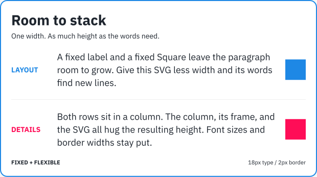
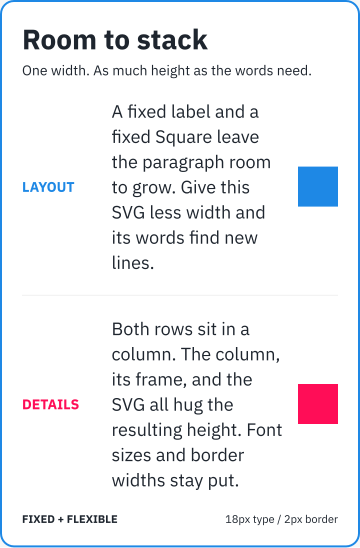

The paragraphs get 433px in the wide document and 173px in the narrow one.
Each changes from three lines to seven. The document's height changes from
345.8px to 547.4px; both renders use 21 layout queries, with prepared glyphs
reused across each paragraph's intrinsic and allocated widths. Compare the
[wide tree](./rendered/stack.tree) and [narrow tree](./rendered/stack_narrow.tree).

```sh
bun scripts/gum.ts examples/stack.jsx --width 440 -o /tmp/stack.png
```

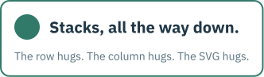

There are no parent dimensions in [this source](./stack_hugging.jsx). Seven
elements require seven queries; the [tree](./rendered/stack_hugging.tree) shows
their natural allocations adding up to a 331.47×96.8 SVG.

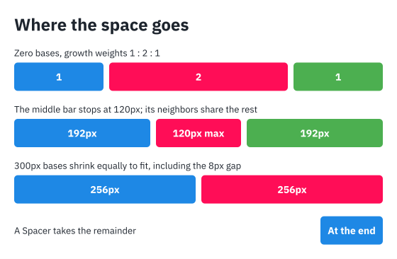

The [flex tree](./rendered/stack_flex.tree) records 126/252/126px in the first row,
192/120/192px after the middle item's maximum, and 256/256px after shrinking
two 300px bases. Each row has 520px, including its 8px gaps. These widths belong
to the Boxes; their labels retain their natural font sizes.

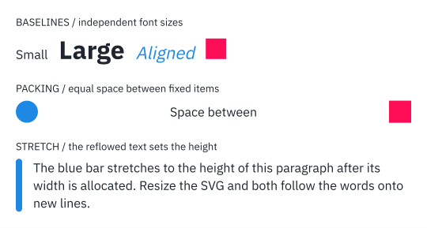

The [alignment tree](./rendered/stack_alignment.tree) exposes the common baseline
and the bar's final height. None of these rows uses fitting or manual placement.

The stage 4 sources use standard Box composition:

| Example | What to inspect |
|---|---|
| [hugging.jsx](./hugging.jsx) | A 64px Square plus 16px padding and a 2px border makes a 100×100 Box and Svg. Neither parent specifies a size. |
| [card.jsx](./card.jsx) | A 360px viewport with content-sized height. The gallery also lays out the same source at 220px. |
| [nesting.jsx](./nesting.jsx) | Nested backgrounds, padding inside and outside a Frame, and a centered label. |
| [box_clip.jsx](./box_clip.jsx) | A centered 280px Square overflowing a 220×100 rounded Box, clipped inside its 6px border. |
| [fitting.jsx](./fitting.jsx) | Fit scales a natural text line to 280×80; Frame and Svg hug the result. |
| [fill_rect.jsx](./fill_rect.jsx) / [fill_ellipse.jsx](./fill_ellipse.jsx) | Unsized aspectless shapes accept both dimensions of a 200×100 viewport. |


The [tree](./rendered/hugging.tree) records the content rectangle at `(18,18)`
and three layout queries suffice. The [SVG](./rendered/hugging.svg) uses these
pixel dimensions directly. No fitting transform is involved.

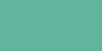


Neither shape specifies width or height. They accept the available dimensions
independently, as shown in the [Rect tree](./rendered/fill_rect.tree) and
[Ellipse tree](./rendered/fill_ellipse.tree). Square and Circle instead preserve
their preferred 1:1 aspect under the same offer. Box can also fill a finite offer
by hugging a child that expands to use the space inside its insets.

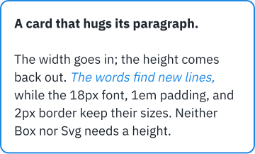
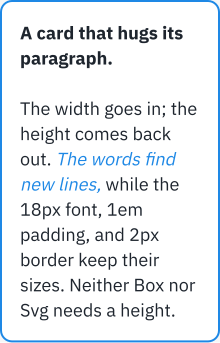

Both cards have an 18px font, 18px padding, and a 2px inside border. Text changes
from seven to twelve lines; the document height changes from 216.4px to 342.4px.
Compare the [wide tree](./rendered/card.tree) and
[narrow tree](./rendered/card_narrow.tree). To try another width:

```sh
bun scripts/gum.ts examples/card.jsx --width 260 -o /tmp/card.png
```

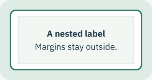

The [tree](./rendered/nesting.tree) distinguishes the inner Box's fixed 240×100
border box from Frame's padding and an enclosing Box with 8px padding. The outer Box
and Svg derive their full 314×166 dimensions from those contributions.

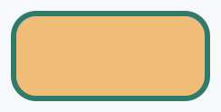

Clipping hides the overflowing Square while retaining its 280×280 allocation and
overflow in the [tree](./rendered/box_clip.tree). Its painted ink is bounded by
the inside of the border. The outer Box's 12px padding contributes to Svg's 244×124 size.


The [fitting tree](./rendered/fitting.tree) keeps the original 16px text geometry
under one uniform transform. Fit fills the offered width while preserving aspect;
the Frame adds its own 16px padding and 2px border afterward.

The earlier protocol, text, and shape examples remain available:

| Example | What to inspect |
|---|---|
| [rectangle.jsx](./rectangle.jsx) | A 240×120 viewport; 0.75 width becomes 180px and 3em height becomes 60px. |
| [repeated.jsx](./repeated.jsx) | One source rectangle, two layouts, three placements, all with 3px strokes. |
| [clipping.jsx](./clipping.jsx) | Original, clipped, and explicitly transformed results; overflow survives clipping. |
| [protocol.ts](./protocol.ts) | Fixed, allocated, expanding, and width-dependent synthetic leaves. |
| [paragraph.jsx](./paragraph.jsx) | One styled paragraph at 408px and 224px; both use an 18px font and reuse prepared measurements. |
| [typography.jsx](./typography.jsx) | Faces, mixed-size baselines, tight leading, preserved whitespace, and line alignment. |
| [shapes.jsx](./shapes.jsx) | Rectangles, circles/ellipses, lines, polylines, polygons, and Bezier paths with 3px strokes. |
| [label.jsx](./label.jsx) | A 2em circle beside a separately sized 20px label. |

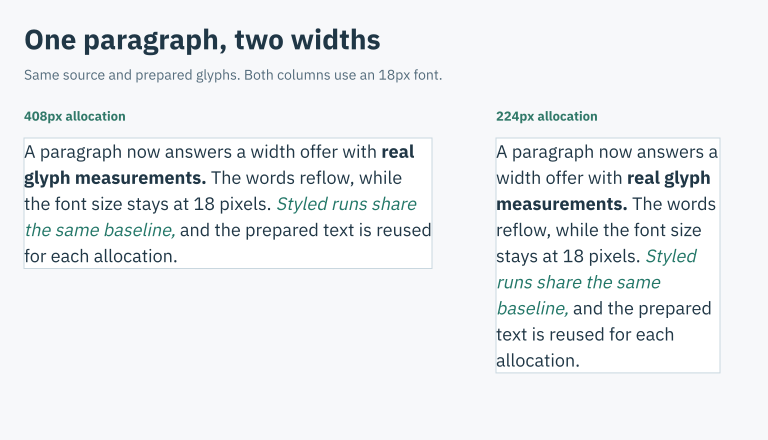

Compare the [SVG](./rendered/paragraph.svg) and [tree](./rendered/paragraph.tree):
the two columns have different line counts and identical glyph sizes. Text is
rendered as outlines with accessible labels, so PNG needs no installed fonts.

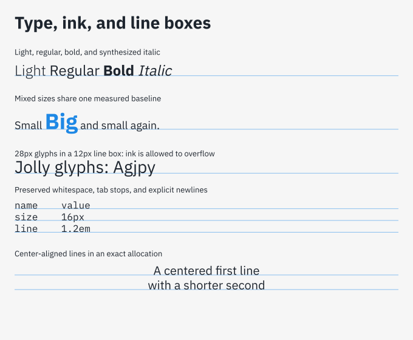

The blue-gray rectangles show allocated line boxes; green lines show measured
baselines. The tight-leading sample keeps its full 28px glyph size and records
overflow. See its [tree](./rendered/typography.tree) for the separate ink bounds.

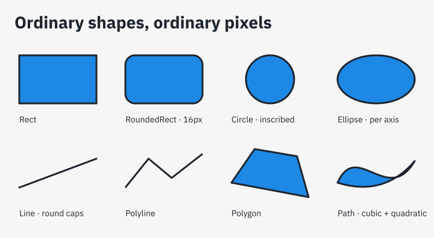

Every shape receives the same 128×80 allocation. Circle uses an inscribed 80px
diameter; Ellipse uses both axes. All strokes stay 3px wide.

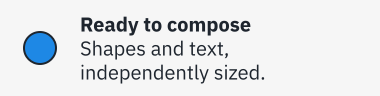

The stage 3 gallery retains its small, explicit placement fixtures as protocol
examples. The stage 5 examples above use standard stacks. All source children
are constructed before layout.

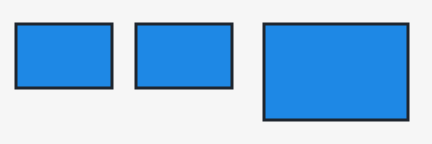

The first two rectangles share the same fragment. The third receives a different
exact allocation. Compare the [SVG](./rendered/repeated.svg) and
[tree](./rendered/repeated.tree): all three strokes remain 3px wide.

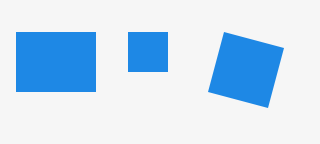

The two clipped placements share a clip definition. The final placement applies
an explicit affine transform after layout. Its visible ink and its unclipped
overflow differ in the [tree](./rendered/clipping.tree).

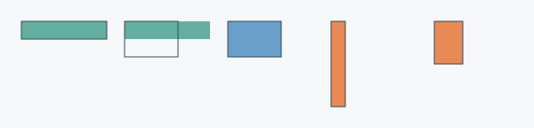

From left to right: a fixed 96×20 leaf offered 60×40; that same content allocated
60×40; an expanding leaf offered 60×40; six 1em cells at a width just below 32px;
and those cells at exactly 32px. The outlines show allocated boxes. The wrapping
fixtures have a 16px font basis and produce heights of 96px and 48px respectively.
These cells stand in for text measurement; they are solid rectangles, not glyphs.

The [unit and sizing probes](./contracts.ts) remain available through
`bun scripts/probe.ts`, including the stage 1 hugging and padding-overflow trees.
